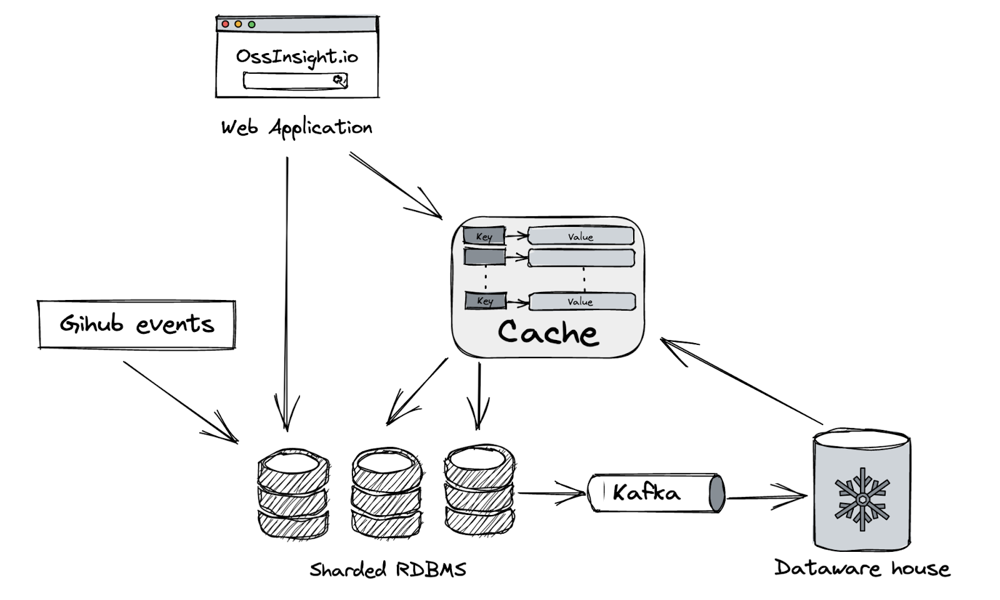
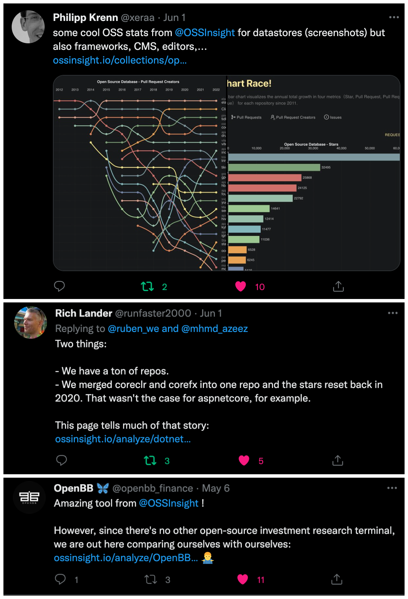
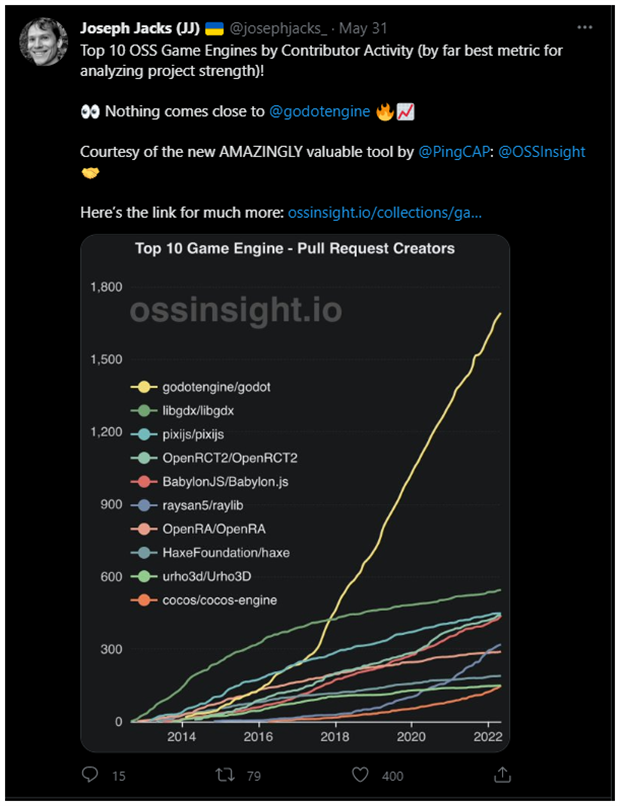

In early January 2022, Max, our CEO, a big fan of open-source, asked if my team could build a small tool to help us understand all the open-source projects on GitHub; and, that if everything worked well, we should open the API to help open source developers to build better insights. In fact, GitHub continuously publishes the public events in its open-source world through the open API. (Thank you and well done! Github). We can certainly learn a lot from the data!  

I was excited about this project until Max said: “You’ve only got one week.” Well, the boss is the boss! Although time was tight and we were faced with multiple head-aching problems, I decided to take up this challenge. 


## Headache 1: we need both historical and real-time data.

After some quick research, we found [GHArchive](https://www.gharchive.org/), an open-source project that collects and archives all GitHub data from 2011 and updates it hourly. By the way, a lot of open-source analytical tools such as CNCF's [Devstats](https://github.com/cncf/devstats) rely on GH Archive, too. 

**Thanks to GH Archive, we found the data source.**

But there's another problem: hourly data is good, but not good enough. We wanted our data to be updated in real time—or at least near real time. We decided to directly use the [GitHub event API](https://docs.github.com/en/rest/activity/events), which collects all events that have occurred within the past hour. 

By combining the data from the GH Archive and the GitHub event API, we can gain streaming, real-time event updates.


<br/>


<center><em>GitHub event updates</em></center>

<br/>


## Headache 2: the data is huge!

After we decompressed all the data from GH Archive, we found there were more than 4.6 billion rows of GitHub events. That’s a lot of data!  We also noticed that about 300,000 rows were generated and updated each hour.

<br/>


<center><em>The data volume of GitHub events occurred after 2011</em></center>

<br/>

The database solution would be tricky here. Our goal is to build an application that provides real-time data insights based on a continuously growing dataset. So, scalability is a must. NoSQL databases can provide good scalability, but what follows is how to handle complex analytical queries. Unfortunately, NoSQL databases are not good at that. 

[image to be updated]

Another option is to use an OLAP database such as ClickHouse. ClickHouse can handle the analytical workload very well, but it is not designed for serving online traffic. If we chose it, we would need another database for the online traffic. 

[image to be updated]

What about sharding the database and then building an extract, transform, load (ETL) pipeline to synchronize the new events to a data warehouse? This sounds workable.

<br/>



<center><em>How a sharded database solution can handle the GitHub data</em></center>

<br/>

According to our project manager's (PM’s) plan, we needed to do some repo-specific or user-specific analysis. Although the total data volume was huge, the number of events was not too large for a single project or user. This meant using the secondary indexes in RDBMS would be a good idea. But, if we decided to use the above architecture, we had to be careful in selecting the database sharding key. For example, if we use `user_id` as the sharding key, then queries based on `repo_id` will be very tricky. 

Also, we're not experts on Kafka and data warehouses, mastering and building such an infrastructure in just one week was a very difficult task for us.

The choice is obvious now, and don't forget PingCAP is a database company! TiDB seems a perfect fit for this, and it's a good chance to eat our own dog food. So, why not using TiDB! :) 
 

**If we use TiDB, can we get:**
- SQL support, including complex & flexible queries? ☑️ 
- Scalability?  ☑️ 
- Secondary index support for fast lookup? ☑️ 
- Capability for online serving? ☑️ 

Wow! It seems we got a winner! 

<br/>


<center><em>TiDB use the secondary index to process 4.6 billion rows of events in 4.9 ms</em></center>

<br/>


**To choose a database to support an application like OSS Insight, we think TiDB is a great choice.** Plus, its simplified technology stack means a faster go-to-market and faster delivery of my boss' assignment. 

## Headache 3: We have a "pushy" PM!

Just as the subtitle indicates, we have a very “pushy” PM, which is not always a bad thing. :)  His demands kept extending, from the single project analysis at the very beginning to the comparison and ranking of multiple repositories, and to other multidimensional analysis such as the geographical distribution of stargazers and contributors. What’s more pressing was that the deadlines stayed unchanged!!! 

**We had to keep a balance between the growing demands and the tight deadlines.**

To save time, we built our website using [Docusaurus](https://github.com/facebook/docusaurus), an open source static site generator in React with scalability, rather than building a site from scratch. We also used [Apache Echarts](https://github.com/apache/echarts), a powerful charting library, to turn analytical results into good-looking and easy-to-understand charts. 

We chose TiDB as the database to support our website, and it perfectly supports SQL. This way, our back-end engineers could write SQL commands to handle complex and flexible analytical queries with ease and efficiency. Then, our front-end engineers would just need to display those SQL execution results in the form of good-looking charts. 

Finally, we made it. We prototyped our tool in just one week, and named it [OSS Insight](https://ossinsight.io/), short for open source software insights. We continued to fine-tune it, and it was [officially released](https://ossinsight.io/blog/explore-deep-in-4.6-billion-github-events/) on May 3. 

## How we deal with analytical queries with SQL

Let's use one example to show you how we deal with complex analytical queries. 

### Analyze a GitHub collection: JavaScript frameworks

[OSS Insight](https://ossinsight.io/) can analyze popular GitHub collections by many metrics including the number of stars, issues, and contributors. Let’s identify which JavaScript framework has the most issue creators. 
This is an analytical query that includes aggregation and ranking. To get the result, we only need to execute one SQL statement: 

```
SELECT
   /*+ read_from_storage(tiflash[ge]) */
   ci.repo_name  AS repo_name,
   COUNT(distinct actor_login) AS num
FROM
   github_events ge
   JOIN collection_items ci ON ge.repo_id = ci.repo_id
   JOIN collections c ON ci.collection_id = c.id
WHERE
   type = 'IssuesEvent'
   AND action = 'opened'
   AND c.id = 10005
   -- Exclude Bots
   and actor_login not like '%bot%'
   and actor_login not in (select login from blacklist_users)
GROUP BY 1
ORDER BY 2 DESC
;
```

In the statement above, the `collections` and `collection_items` tables store the data of all GitHub repository collections in various areas. Each table has 30 rows. To get the order of issue creators, we need to associate the repository ID in the `collection_items` table with the real, 4.6-billion-row `github_events` table as shown below. 


```

mysql> select * from collection_items where collection_id = 10005;
+-----+---------------+-----------------------+-----------+
| id  | collection_id | repo_name             | repo_id   |
+-----+---------------+-----------------------+-----------+
| 127 | 10005         | marko-js/marko        | 15720445  |
| 129 | 10005         | angular/angular       | 24195339  |
| 131 | 10005         | emberjs/ember.js      | 1801829   |
| 135 | 10005         | vuejs/vue             | 11730342  |
| 136 | 10005         | vuejs/core            | 137078487 |
| 138 | 10005         | facebook/react        | 10270250  |
| 142 | 10005         | jashkenas/backbone    | 952189    |
| 143 | 10005         | dojo/dojo             | 10160528  |
...
30 rows in set (0.05 sec)

```

Next, let's look at the execution plan. TiDB is compatible with MySQL syntax, so its execution plan looks very similar to that of MySQL.

In the figure below, notice the parts in red boxes. The data in the table `collection_items` is read through `distributed[row]`, which means this data is processed by TiDB’s row storage engine, TiKV. The data in the table `github_events` is read through `distributed[column]`, which means this data is processed by TiDB’s columnar storage engine, TiFlash. TiDB uses both row and columnar storage engines to execute the same SQL statement. This is so convenient for OSS Insight because it doesn’t have to split the query into two statements. 

<br/>


<center><em>TiDB execution plan</em></center>

<br/>


TiDB returns the following result: 

```
+-----------------------+-------+
| repo_name             | num   |
+-----------------------+-------+
| angular/angular       | 11597 |
| facebook/react        | 7653  |
| vuejs/vue             | 6033  |
| angular/angular.js    | 5624  |
| emberjs/ember.js      | 2489  |
| sveltejs/svelte       | 1978  |
| vuejs/core            | 1792  |
| Polymer/polymer       | 1785  |
| jquery/jquery         | 1587  |
| jashkenas/backbone    | 1463  |
| ionic-team/stencil    | 1101  |
...
30 rows in set
Time: 7.809s

``` 

Then, we just need to draw [the result](https://ossinsight.io/blog/deep-insight-into-js-framework-2021/#which-javascript-framework-have-the-widest-feedback-sources) with Apache Echarts into a more visualized chart as shown below. 

<br/>


<center><em>JavaScript frameworks with the most issue creators</em></center>

<br/>


Note: You can click the `REQUEST INFO` on the upper right side of each chart to get the SQL command for each result. 

## Feedback: People love it!

After we released OSS Insight on May 3, we have received loud applause on social media, via emails and private messages, from many developers, engineers, researchers, and people who are passionate about the open source community in various companies and industries. 

I am more than excited and grateful that so many people find OSS Insight interesting, helpful, and valuable. I am also proud that my team made such a wonderful product in such a short time. 

<br/>





<center><em>Applause given by developers and organizations on Twitter</em></center>

<br/>


## Lessons learned 

Looking back at the process we used to build this website, we have learned many mind-refreshing lessons.

**First, quick doesn’t mean dirty, as long as we make the right choices.** Building an insight tool in just one week is tricky, but thanks to those wonderful, ready-made, and open source projects such as TiDB, Docusaurus, and Echarts, we made it happen with efficiency and without compromising the quality.  

**Second, it’s crucial to select the right database—especially one that supports SQL.** TiDB is a distributed SQL database with great scalability that can handle both transactional and real-time analytical workloads. With its help, we can process billions of rows of data with ease, and use SQL commands to execute complicated real-time queries. Further, using TiDB means we can leverage its resources to go to market faster and get feedback promptly.  

If you like our project or are interested in joining us, you’re welcome to **[submit your PRs]((https://github.com/pingcap/ossinsight)** to our GitHub repository. You can also follow us on [Twitter](https://twitter.com/OSSInsight) for the latest information. 


:::note

### 📌 Join our workshop

If you want to get your own insights, you can [join our workshop](https://share.hsforms.com/1E-qtGQWrTVmctP8kBT34gw2npzm) and try using TiDB to support your own datasets. 

:::